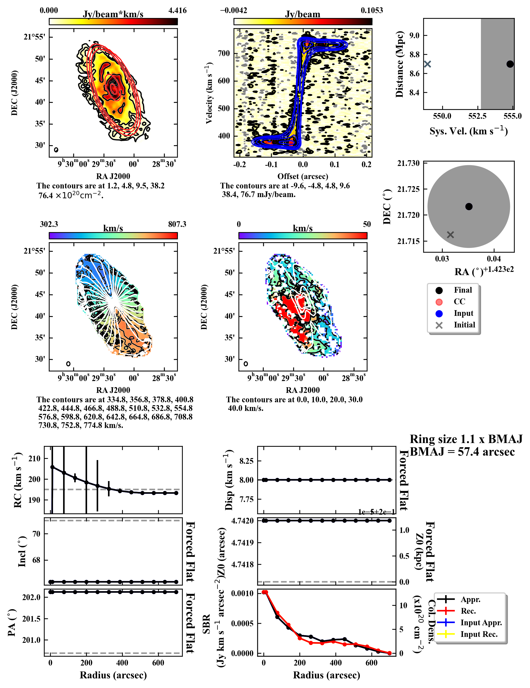

# Python Fully Automated TiRiFiC (pyFAT)
=====

Introduction
------------

The Python Fully Automated TiRiFiC is a python (> 3.6) wrapper around the tilted ring fitting code ([TiRiFiC](http://gigjozsa.github.io/tirific/)) that aims to fully automate the process of fitting simple tilted ring models to line emission cubes. This python version is in continuous development and hence errors and bugs can be present. Nevertheless, the code has extensively been tested and the results and a more extensive description of the code are documented in [Kamphuis et al. 2015](http://arxiv.org/abs/1507.00413) and [Kamphuis et al. in prep]

The file [Current_Status.pdf](./Current_Status.pdf)  provides an overview of the default test sets provided by the [HI TRM Database](https://github.com/PeterKamphuis/HI_TRM_Test_Database) which illustrate the performance of the current release version of FAT. This fully tested version is available on the master branch. In release 2.0 the code has permanently switched to python development in order to maintain easier use and a larger development base. The final IDL/GDL version is release 1.5. The python version strives to be an improvement on the IDL/GDL version and has been extensively tested to at the very least match the results of the older code. However, should you find that your fits have significantly degraded please open an issue on the GitHub and let us know. From release 2.0 the intention is to maintain a more regular release policy when the code has undergone major development. For the very latest version of FAT one can always check the available branches but these come without any quality guarantees.

If you are looking for specific functionality or find that FAT is not performing well despite the galaxy having regular rotation or just want to chat about tilted ring modelling pipelines please do not hesitate to contact me.

It is important to remember that FAT is meant for batch fitting. Hence, the aim of the code is to provide tilted ring models that are accurate for a large fraction of galaxies. Ideally, FAT should identify galaxies that are not fitted well however this feature is not optimal yet. When fitting individual galaxies it is recommended to run FAT and then fine tune the model by hand in [TiRiFiC](http://gigjozsa.github.io/tirific/). In most cases such fine tuning will be limited to a few outer rings but in the case of complex galaxies with significant non-cylindrically symmetric motions the models can fail (Or in the case of very bad data but that is not a FAT issue).

FAT is not an automated version of the extended functionality of [TiRiFiC](http://gigjozsa.github.io/tirific/). FAT fits simple rotationally symmetric discs with asymmetric warps and surface brightness distributions. However, [TiRiFiC](http://gigjozsa.github.io/tirific/) itself provides a much more extended functionality and should be used for identifying significant non-cylindrically symmetric motions, thick discs, bars and other such HI features. When modelling such galaxies ideally FAT can provide a base model and setup a .def file with merely a thin disc. These can then be used in [TiRiFiC](http://gigjozsa.github.io/tirific/) in order to explore large scale motions not captured by FAT’s simple model. For examples of such modelling please see [Kamphuis et al. (2011)](http://adsabs.harvard.edu/abs/2011MNRAS.414.3444K), [Zschaechner et al. (2011)](http://adsabs.harvard.edu/abs/2011ApJ...740...35Z), [Kamphuis et al. (2013)](http://adsabs.harvard.edu/abs/2013MNRAS.434.2069K), [Gentile et al. (2013)](http://adsabs.harvard.edu/abs/2013A%26A...554A.125G).

Requirements
------------
The code requires full installation of:

    python v3.6 or higher
    astropy, matplotlib, numpy and scipy (Versions unknown for now)
    TiRiFiC v2.2.3 or higher
    SoFiA2  

[astropy](https://www.astropy.org/), [python](https://www.python.org/),[TiRiFiC](http://gigjozsa.github.io/tirific/download_and_installation.html), [SoFiA2](https://github.com/SoFiA-Admin/SoFiA-2)

TiRiFiC and SoFiA2 should be accessible for subproccess calls this normally means that it should be possible to invoke them propoerly from the command line.

Installation
------------

Download the source code from the Github. Once downloaded pyFAT can be installed with:

  pip install path_to_code

This should also install all required python dependencies.
We recommend the use of python virtual environments. If so desired a pyFAT installation would look like:

  python3 -m venv FAT_venv
  source FAT_venv/bin/activate
  pip install path_to_code
  deactivate
  source FAT_venv/bin/activate

Once you have installed FAT you can check that it has been installed properly by running FAT as.

  FAT>  pyFAT --ic

This should take typically 10 min and should finish with the message:

	!!!!--------------------------------------------!!!!!
	!!!! As far as we can tell FAT is installed     !!!!!
	!!!! properly and runs smoothly.                !!!!!
	!!!!--------------------------------------------!!!!!

The check consists of fitting a flat disk on NGC 2903. The data for this galaxy were take as part of the WHISP program.
This survey is decribed in [van der Hulst et al. (2001)](http://adsabs.harvard.edu/abs/2001ASPC..240..451V) and the data can be found at [Westerbork on the Web](http://wow.astron.nl/) or the [WHISP page](https://www.astro.rug.nl/~whisp/).

If you get any other message please do not hesitate to file an issue here. Do not however that if you perform this check on a unreleased version/branch it might not perform well. So always check with the master branch.

The Overview.png will contain a comparison with the fit performed by you. These should be the same (the correct fit is classified Input.)

The plots should look like this:

Sometimes, due to updates in SoFiA2 or TiRiFiC, the check might show differences beyond the tolerance limits. If these are small and you have checked the individual installations of SoFiA2, TiRiFiC and the Installation Check files are older than the latest SoFiA2 or TiRiFiC update, then the installation is probably correct and you can continue. Please do post an issue about the outdated installation check.

Running FAT
-----------
FAT is currently run under python and can be run from the command line

    FAT> pyFAT -h

Will provide an overview of call options. For the most basic usage one can call FAT with a configuration file.

    FAT> pyFAT -c pathtodir/configfile.config

FAT is intended for batch fitting and as such it is recommended to have all source in separate directories

All information that the code needs about output directories fitting steps and input parameters are taken from the configfile.
If a config file is not given it will look for the file 'FAT_INPUT.config' in the directory from which FAT is run.

Configuration File
------

A configuration file will require the following parameters:

        catalogue=Path_to_catalog_dir/Catalog.txt

The code requires a catalogue with input sources to know which cubes to fit and where they are (See Below) the catalogue keyword should provide the path to this catalogue. There is no default for this.

        maindir=Path_to_dir_with_input/

maindir should contain the path where the directories for all galaxies are stored. FAT can produce large amounts of output if requested (e.g. Models for each step, xvdiagrams, Fitting logs, see maps_output parameter). In order to keep this managable each galaxy requires its own directory. There is no default for this parameter.

        outputcatalogue=Path/nameofresult.txt

In these three variables `Path_to_catalog_dir`,`Path_to_dir_with_input` and `Path` should be replaced with the local path name to where your input catalog can be found, the path to the directory where the galaxy directories reside and the path to where you want the output catalog to be.
The code will write a summary of the succes of the fit for each galaxy in this file.

        new_output='y'

new_ouput controls whether you want a new output catalogue with the summary of the fits done by FAT. If set to 'n'  the existing catalogue will be appendended. Typically you would want new output when starting a new batch fit and append if you are restarting a batch fit. Default ='y'

        startgalaxy=0

The catalogue number at which the code should start. The default is -1 which is the first line

        endgalaxy=-1

The catalogue number at which the code should stop. The default is -1 which means that it should run until the end of the catalog.

        outputlog=fitlog.txt

The name of a log file that will trace the iterations and steps that the code is executing for each galaxy. This file is written into the galaxy directory. If left out no log file will be written and additional output will be printed to the terminal.

        new_log='y'

Do you want to write a new log file. If set to 'n'  the existing log file will be appendended. Default='y'

        velocity_resolution=1

The velocity resolution of the data cubes. If set to zero the code assume that the instrumental dispersion is equal to a (1.2 x channel)/(2 x SQRT(2ln2)) otherwise (1+vresolution) x channel/(2 x SQRT(2ln2)). That is, if set to 1 it assumes Hanning smoothing. Default=1.

        maps_output = 2

Maps_output controls the amount of outpur created by FAT.  0.= all possible output (This is a lot), 1= all steps model + maps + def files, 2 = Final model + maps + def files for steps + logs, 3 = Only final model def + logs. Default = 2

	warp_output = 0

FAT provides the possibility to get information about the fitted warp (Tiltograms, Warp radius, Max angle) if this is required warp_output should be set to 1. 	

# 1 = start from orginal cube (Default)
# 2 = start from FAT cube if present
# 3 =  use provided preprocessing from Sofia
# 4 =  Skip Central Convergence
    start_point=1        

Parameter for setting the type of input for the initial guesses. possible setting are 1, 2, 3, 4
1) Start from orginal cube.
2) Start from the cube that has been made FAT compliant
3) Start from pre-processed SoFiA2 output
4) Start after the Central Convergence step. This assumes this step has been ran previously and its output is present.

        finishafter=2.

Parameter for finishing the fitting process early. if set to one the program finishes after fitting the flat disk. Default = 2

        opt_pixelbeam=4.

The amount of pixels in the FWHM of the minor axis. Default = 4.

A default config file (FAT_INPUT.config) is included in the distribution.

Input Catalog
-----------

The input catalog should have at least 4 columns named as

        number|distance|directoryname|cubename

and seperated by |
The number is an easy identifier to keep track of which galaxy is being fitted.
the distance is the distance to the galaxy in Mpc. This is used to make some initial guesses for the structure of the galaxy. If it is unknown it should be set to 1.
The directory name is the name of the directory of the galaxy to be fitted. This directory should be located in the specified maindir in the config file.
cubename is the name of the cube to be fitted. This should be without the fits extension.

An example catalog is included in the distribution. This also gives examples for how to set up a catalog when using pre-made sofia input, i.e. allnew=2
